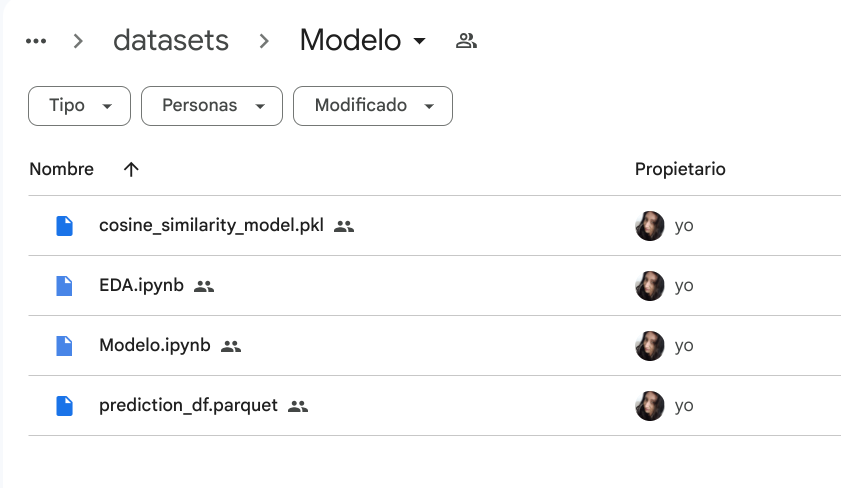

# Descripción de Carpetas - Henry_Steam

Este repositorio contiene la organización de archivos y notebooks utilizados en el proyecto "Henry_Steam".

## dataset

Carpeta principal que contiene a las demas.

## json

Aquí se encuentran los datos originales en formato JSON que se utilizaron como punto de partida en el proyecto. Los archivos contenidos aquí representan la base sobre la que se trabajó para el procesamiento y análisis de datos.

## Etl

Esta carpeta alberga los Notebooks utilizados para el proceso de Extracción, Transformación y Carga de los datos. 

## cleaned

La carpeta `cleaned` contiene los archivos resultantes después de la limpieza y conversión a formatos CSV y Parquet.

## endpoint

En esta carpeta se encuentra el notebook en el que se desarrollaron y configuraron los distintos endpoints solicitados. Además, se encuentran los archivos Parquet generados como resultado de este proceso.

## Modelo

La carpeta `Modelo` contiene los recursos relacionados con el modelo de machine learning utilizado en el proyecto. Incluye el notebook donde se creó el modelo, el modelo entrenado en formato Pickle y el DataFrame utilizado para el entrenamiento.

## Uso

Cada carpeta tiene un propósito específico:

- `json`: Para datos originales en formato JSON.
- `Etl`: Para los Notebooks para el proceso de ETL.
- `cleaned`: Para guardar los archivos resultantes después de la limpieza y conversión.
- `endpoint`: Para el desarrollo de endpoints y los archivos generados como resultado.
- `Modelo`: Para los recursos relacionados con el modelo de machine learning.

### [Volver](README.md)